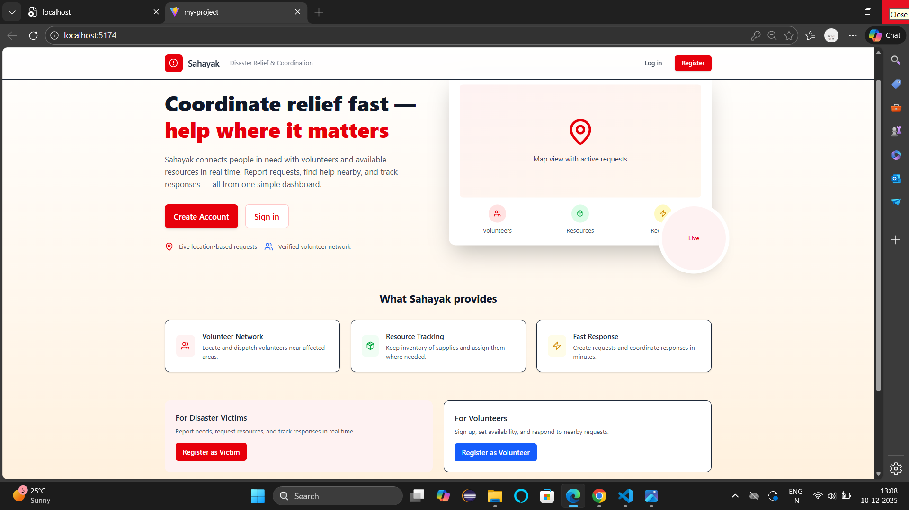
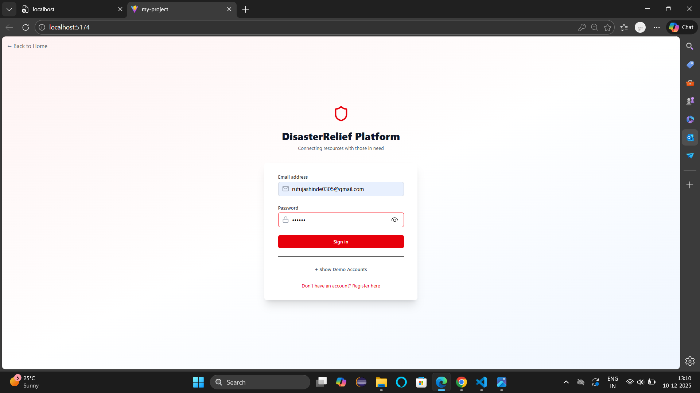
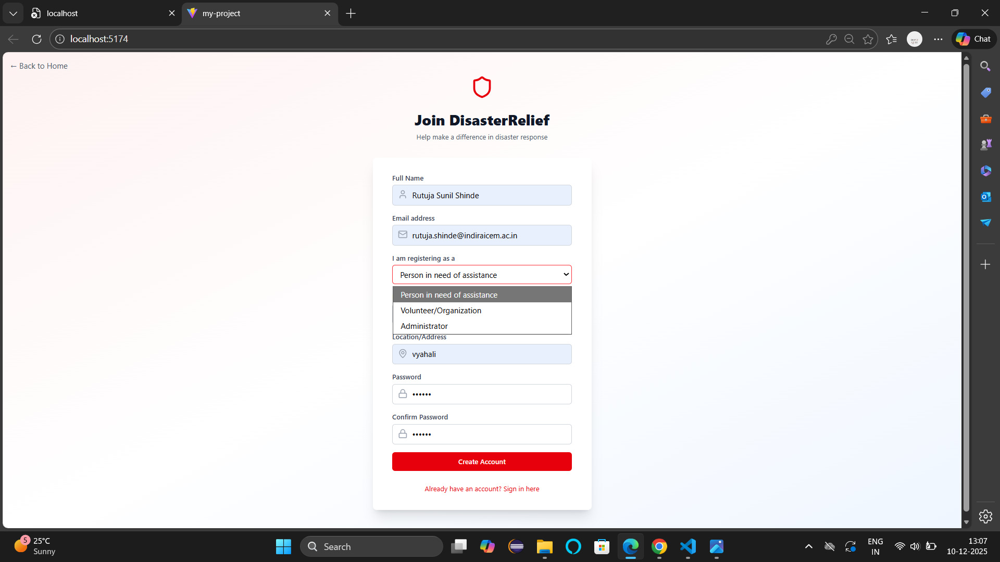
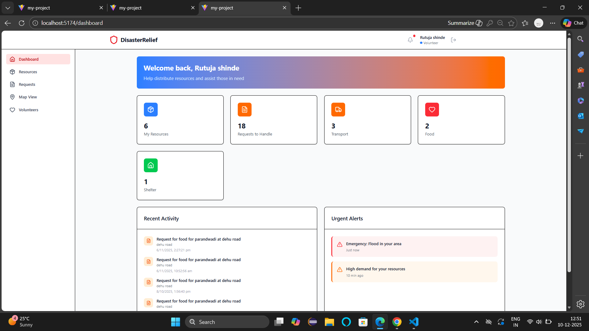
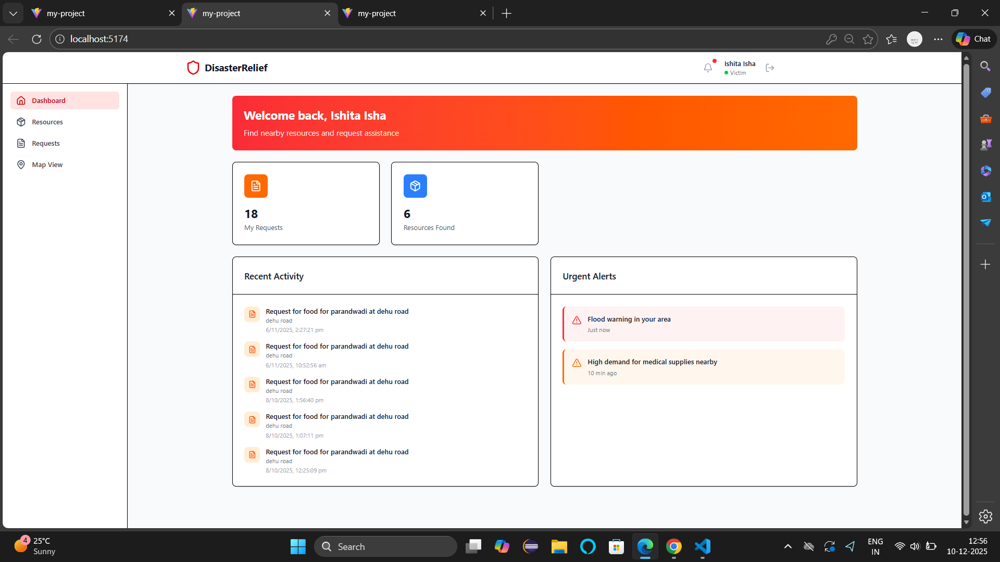
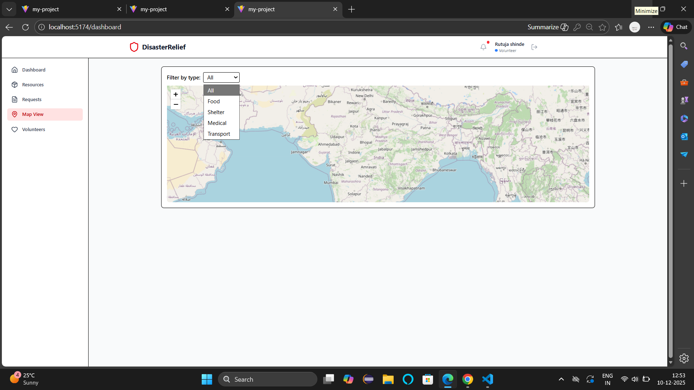
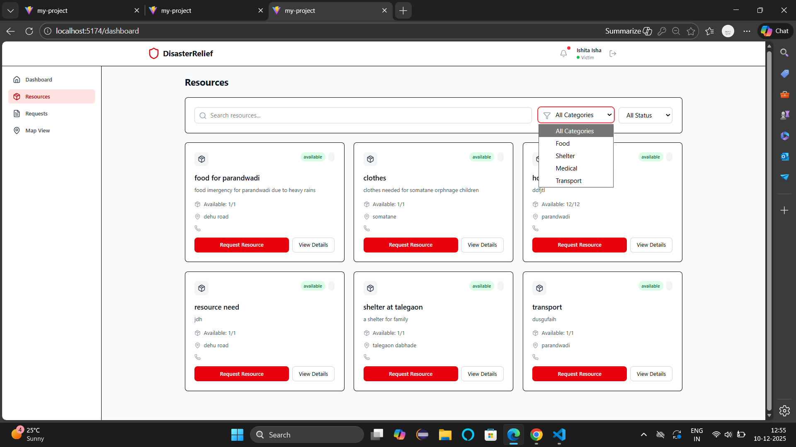
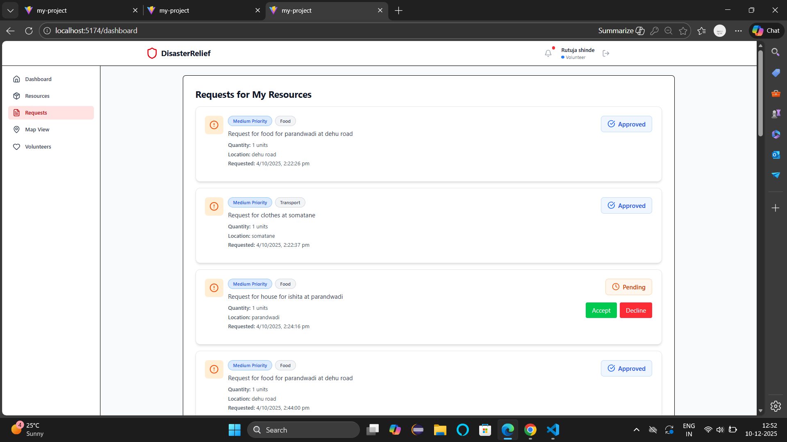
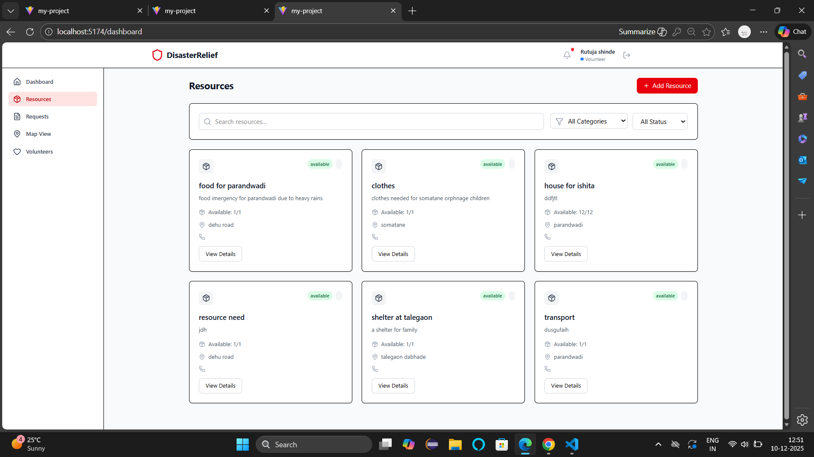

# Sahayak — Disaster Relief (frontend)

This front-end is a React + Vite application for the Sahayak Disaster Relief project. It includes a polished landing page, authentication forms (login/register), dashboard views, and a proxy to the backend API.

## Quick Start (development)

Prerequisites:
- Node.js (16+ recommended)
- npm
- Backend running (see backend/README or the `backend` folder)

Start the backend (in a separate terminal):

```powershell
cd e:/Sahayak-DisasterReliefVite/DisasterReliefVite/backend
npm install
# ensure .env is configured (MONGO_URI, PORT=3001, TWILIO_...)
npm start
```

Start the frontend dev server:

```powershell
cd e:/Sahayak-DisasterReliefVite/DisasterReliefVite/my-project
npm install
npm run dev
```

The app will open at `http://localhost:5174/` (Vite may choose a different port if 5173 is in use).

## Environment / Proxy
- The development Vite server proxies API requests starting with `/api` to the backend. The proxy target is configured in `vite.config.js` and should point to your backend port (by default: `http://localhost:3001`).
- Backend `.env` keys used: `PORT`, `MONGO_URI`, `TWILIO_ACCOUNT_SID`, `TWILIO_AUTH_TOKEN`, `TWILIO_PHONE_NUMBER`.

If the frontend reports `Failed to load resource: 403 (Forbidden)`, check:
- That the backend is running and listening on the port configured in `vite.config.js` proxy (default `3001`).
- DevTools  Network to inspect request URL and response body.

## Screenshots
Below are screenshots taken from the app (located in `public/screenshots/`). 




















## Notifications
- The app has a global notification banner (top of the app) that shows success/error messages for login and registration. If you prefer a persistent toast, tell me and I can change the UI.

## Build for production

```powershell
cd e:/Sahayak-DisasterReliefVite/DisasterReliefVite/my-project
npm run build
```

## Troubleshooting
- Port conflicts: If `npm start` for backend errors with `EADDRINUSE` or the frontend switches ports, stop the conflicting process or change the port in the `.env` and `vite.config.js` proxy.
- API errors: Check backend logs (terminal running `backend/npm start`) — the backend logs incoming login attempts and registration events.

## Where to find things
- Frontend source: `my-project/src`
- Auth context: `my-project/src/context/AuthContext.jsx`
- Login/Register forms: `my-project/src/components/auth/`
- Landing page: `my-project/src/components/HomePage.jsx`

